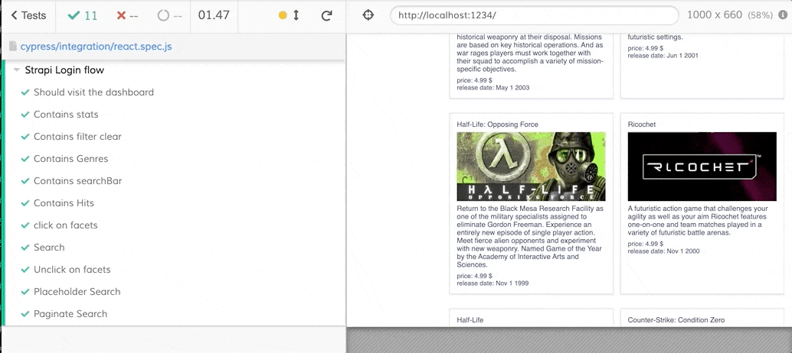

# Cypress: front-end testing

[Cypress](https://www.cypress.io/) is a fast, easy and reliable testing tool for anything that runs in a browser.

## Motivations

As browser testing was, until now, a complex task, we did not add browser testing in our repositories.

The absence of front-end tests makes it dangerous to accept any PR; reviews ask for a lot of manual front-end testing, and thus merging becomes an overall unreliable, time-consuming task.

With Cypress, every aspect of front-end testing is made very simple:

- Implementation of the testing library
- Creating and adding tests
- Adding Cypress to the CI

## How Does Cypress Work

Cypress runs your tests in all the specified browsers. Both in headless mode (without a browser opening) and an open mode so you can observe why tests are failing in the browser itself.

This is the none-headless mode:



## Requirements

- Node.js >= v12
- [The browsers](https://docs.cypress.io/guides/guides/launching-browsers) you want to tests

## Installation

In a Node.js environment, install the Cypress package:

```bash
yarn add cypress --dev
```

or with npm:

```bash
npm install cypress --save-dev
```

If you have the following error:

```
error cypress@7.4.0: The engine "node" is incompatible with this module. Expected version ">=12.0.0". Got "10.22.1"
```

It means that you are probably using `node` version `10`. Please upgrade to at least `v12` as [Node.js 10 not maintained anymore](https://endoflife.date/nodejs).

## Setup Cypress

The tests are looked for by Cypress in the following sub-folder `cypress/integration`. So let us create the sub-folders and our first test file.

```
mkdir cypress
cd cypress
mkdir integration
cd integration
touch first_tests.specs.js
```

**Setup is done.**

## Create Tests

Let's open `first_tests.specs.js` to create some tests.

```js
const HOST = `http://localhost:8080` // Please adjust to your own app port

describe(`My first test`, () => {
  before(() => {
    cy.visit(HOST) // Visit our app
  })

  it('Should visit the dashboard', () => {
    cy.url().should('match', new RegExp(HOST)) // The current host URL
  })
})
```

_You might have some ESLint error, please consult [next section](#cleaning) to remove errors._

Before testing, run your app using your starting script (for example `yarn start` or `yarn serve`). Following the above example, we are assuming it is served on port `8080`. If it's not, change it accordingly with your port.

Now let's run the tests in not-headless and watch mode so we can see what is happening:

```
cd ../.. # Go back to the root of the project
npx cypress open
```

This will open the following dashboard.


Click on the file name `first_tests.specs.js`. This should run the tests:


The tests will run again on every change in your code (watch mode).

To run the tests in headless mode:
```
npx cypress run
```

Starting from there, you can add more tests. See example on [our Strapi plugin](https://github.com/meilisearch/strapi-plugin-meilisearch/blob/main/cypress/integration/ui_spec.js) or [instant-meilisearch](https://github.com/meilisearch/instant-meilisearch/blob/main/cypress/integration/react.spec.js).

For example:
```js
it('Contains title', () => {
    cy.contains('Movies Demo with MeiliSearch')
})
```

## Running Server and Tests in One Command

A limitation of the previous system is that we have to both start our app on one side and the tests on the other.<br>
A solution is to launch both with the same command using [start-server-and-test](https://www.npmjs.com/package/start-server-and-test).<br>
This package will start your app, wait for it to be fully running, and then run the tests.

The following command will run the tests in headless mode once the server is running. When the tests are done, the process is killed.

```bash
npx start-server-and-test start http://localhost:8080 'cypress run'
```

It is also possible in no-headless mode:

```bash
npx start-server-and-test start http://localhost:8080 'cypress open'
```

See example in [instant-meilisearch](https://github.com/meilisearch/instant-meilisearch/blob/main/scripts/e2e.sh).

## Cleaning

### Remove ESLint errors

When using `eslint`, errors might be raised because of the unrecognized globals Cypress introduces (same as jest).

Please add the following package:

```
yarn add eslint-plugin-cypress --dev
```

And update your `eslint` config file:

```js
extends: [
    ...
    'plugin:cypress/recommended',
],
```

### Update your `.gitignore`

Cypress creates additional directories inside `cypress` that are usefull but should maybe not be pushed:

- `/videos`: Every test run will generate a video you can watch to see what went wrong.
- `/screenshots`: Contains screenshots in case of test failures.
- `/fixtures`: Only keep if needed.
- `/plugins`: Only keep if needed.
- `/support`: Only keep if needed.

To avoid pushing these directories, add them to your `.gitignore`

```
# Cypress
cypress/screenshots
cypress/videos
cypress/support
cypress/plugins
cypress/fixtures
```

## CI Implementation with GH Actions

[Cypress has a github-action](https://github.com/cypress-io/github-action) to ease CI testing.

Using the following setup, your tests will run on a Google Chrome browser and create artifacts in GitHub in case of failure:
```yml
 cypress-run:
    runs-on: ubuntu-latest
    # Browser on which the tests are run
    container: cypress/browsers:node12.18.3-chrome87-ff82
    steps:
      - name: Checkout
        uses: actions/checkout@v2
      - name: Setup node
        uses: actions/setup-node@v1
        with:
          node-version: '12.x'
      - name: Install dependencies
        run: yarn
      - name: Browser tests
        uses: cypress-io/github-action@v2
        with:
          # Your starting script
          start: yarn start
      # Creates and uploads GitHub artifacts in case of failure
      - uses: actions/upload-artifact@v1
        if: failure()
        with:
          name: cypress-screenshots
          path: cypress/screenshots
      - uses: actions/upload-artifact@v1
        if: failure()
        with:
          name: cypress-videos
          path: cypress/videos
```

## Conclusion

Testing in front-end became a more accessible task. We should not hesitate to add tests as they avoid losing **a lot of time** in the long run 🏃‍♀️
