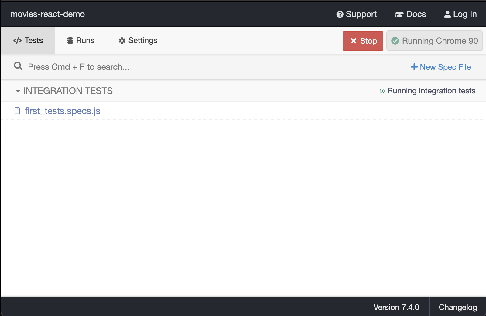
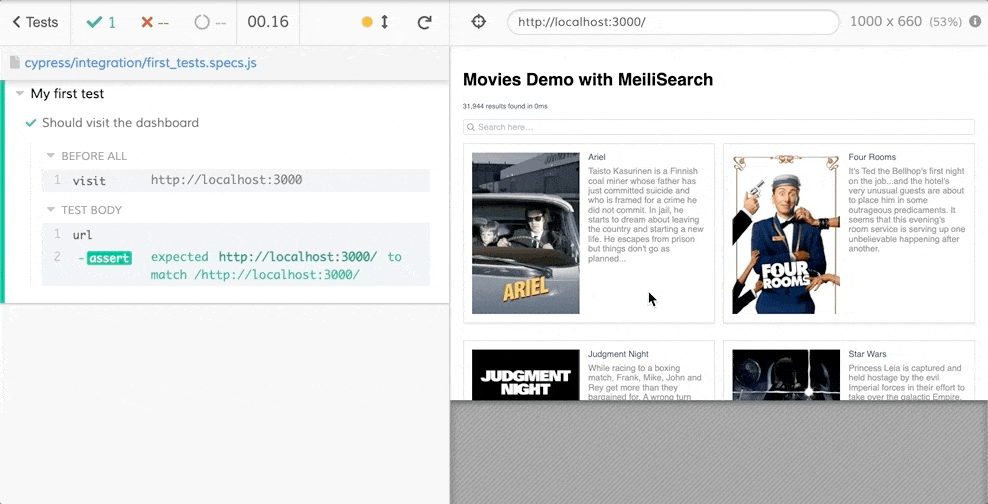

# Cypress: front-end testing

[Cypress](https://www.cypress.io/) is a fast, easy and reliable testing tool for anything that runs in a browser.

## Motivations

As browser testing was until now a complex task, we did not add browser testing in our repositories.

Today, we are creating more and more untested front-end tools, demos and webpages. The absences of tests makes it dangerous to accept any PR, reviews asks for a lot of manual front-end testing and thus merging becomes a overall a unreliable time consuming task.

With Cypress, every aspect of front-end testing is made very very simple: 

- Implementation of the testing library
- Creating and adding tests
- Adding cypress to the CI

## How Does Cypress Work

Cypress runs your tests in all the specified browsers. Both in headless mode (without a browser oppening) but also in open mode so you can observe why tests are failing in the browser itself.

This is the none-headless mode:


## Requirements:
- Node >= v12
- [The browsers](https://docs.cypress.io/guides/guides/launching-browsers) you want to tests


## Installation

In a node environment install the package.

```bash
yarn add cypress --dev
```

or with npm 
```bash
npm install cypress --save-dev
```

If you have the following error: 
```
error cypress@7.4.0: The engine "node" is incompatible with this module. Expected version ">=12.0.0". Got "10.22.1"
```
It means that you are probably using node version `10`. Please upgrade to at least `v12` as [node 10 not maintained anymore](https://endoflife.date/nodejs). 


## Setup cypress

The tests are looked for by cypress in the following sub-folder `cypress/fixtures`. Lets create the sub-folders and our first test file. 

```
mkdir cypress
cd cypress
mkdir fixtures
cd fixtures 
touch first_tests.specs.js
```

**Setup is done.**

## Create Tests 

Lets open `first_tests.specs.js` to create some tests. 

```js
const HOST = `http://localhost:8080` // please adjust to correct app port

describe(`My first test`, () => {
  before(() => {
    cy.visit(host) // Visit our app
  })

  it('Should visit the dashboard', () => {
    cy.url().should('match', /http:\/\/localhost:8080/) // Is the current URL our host
  })
})
```
_You might have some eslint error, please consult [next section](#cleaning) to remove errors_

Before testing run your app using your starting script (for example`yarn start` or `yarn serve`). Following the above example i'm assuming it will be served on port `8080`, don't forget to change it with your port.


Now lets run the tests in not-headless and watch mode so we can see what is happening: 

```
npx cypress open
```

This will open the following dashboard




Click on the file name `first_tests.specs.js`. This should run the tests: 



The tests will run again on every change in your code (watch mode).

To run the tests in headless mode: 
```
npx cypress run
```

Starting from there, you can add more tests. See example on [our strapi plugin](https://github.com/meilisearch/strapi-plugin-meilisearch/blob/main/cypress/integration/ui_spec.js).

For example: 
```js
it('Contains title', () => {
    cy.contains('Movies Demo with MeiliSearch')
})
```

## Cleaning

### Remove eslint errors

When using eslint, errors might be raised because of the unrecognized globals cypress introduces (same as jest).
Please add the following package.

```
yarn add eslint-plugin-cypress --dev
```

and update your eslint config file: 

```js
extends: [
    ...
    'plugin:cypress/recommended',
],
```

### Git ignore unecessary directories

Cypress creates additional directories inside `cypress` that are usefull but should maybe not be pushed: 

- `/videos`: Every test run will generate a video you can watch to see what went wrong
- `/screenshots`: Contains screenshots in case of test fails.
- `/fixtures`: Only keep if needed 
- `/plugins`: Only keep if needed
- `/support`: Only keep if needed

To avoid pushing these directories add them to you `.gitignore`

```
# Cypress
cypress/screenshots
cypress/videos
cypress/support
cypress/plugins
cypress/fixtures
```


### CI implementation

[Cypress has a github-action](https://github.com/cypress-io/github-action) to ease CI testing. 

Using the following setup, your tests will run on a chrome browser and create artifacts in github in case of failure:
```yml
 cypress-run:
    runs-on: ubuntu-latest
    # Browser on which the tests are runned
    container: cypress/browsers:node12.18.3-chrome87-ff82
    steps:
      - name: Checkout
        uses: actions/checkout@v2
      - name: Setup node
        uses: actions/setup-node@v1
        with:
          node-version: '12.x'
      - name: Install dependencies
        run: yarn
      - name: Browser tests
        uses: cypress-io/github-action@v2
        with:
          # Your start script
          start: yarn start
      # Creates github artifacts in case of failure
      - uses: actions/upload-artifact@v1
        if: failure()
        with:
          name: cypress-screenshots
          path: cypress/screenshots
      - uses: actions/upload-artifact@v1
        if: failure()
        with:
          name: cypress-videos
          path: cypress/videos
```


## Conclusion

Testing in front-end became a more accessible task. We should not hesitate to add tests as they avoid losing **a lot of time** on the long run. 